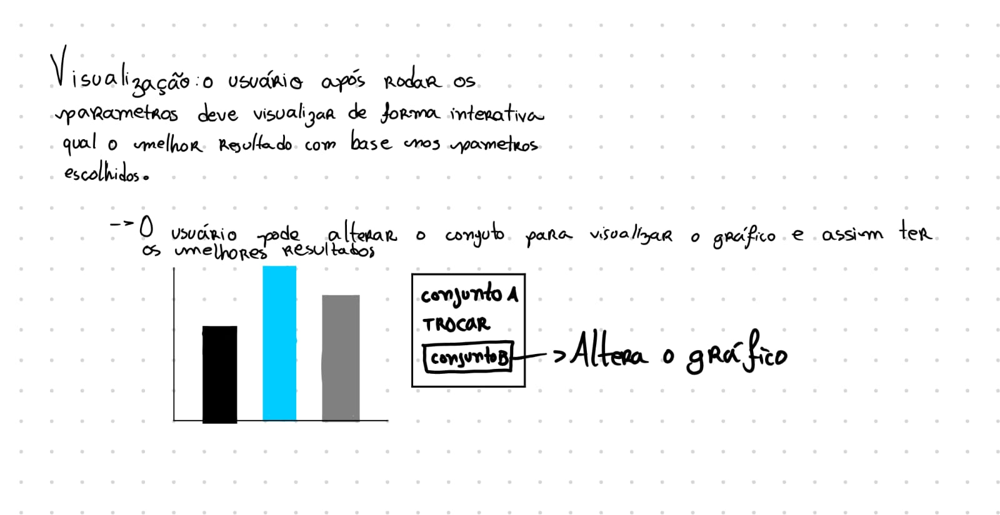
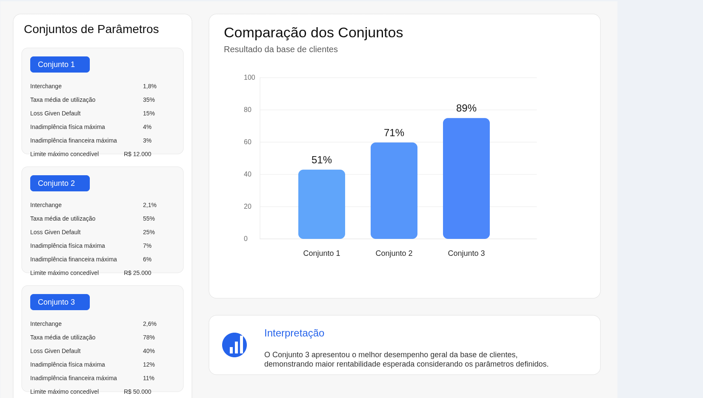

# Introdução à Proposta

A visualização proposta refere-se a uma seção do dashboard a ser entregue ao cliente, contendo um gráfico que realiza um comparativo entre os conjuntos de parâmetros inseridos pelo usuário, com base nos dados importados para a plataforma.  Esses conjuntos de parâmetros estão relacionados às variáveis matemáticas utilizadas no desenvolvimento do algoritmo, sendo fundamentais para definir o valor final do limite de crédito. 

Assim, por meio do gráfico gerado, é possível analisar o melhor resultado de crédito com base no conjunto de parâmetros informados pelo usuário. Além disso, os parâmetros utilizados podem ser visualizados na lateral da interface e também ao passar o cursor sobre as barras do gráfico.

# Rascunhos Iniciais

Para o desenvolvimento inicial da ideia, foi utilizada uma plataforma de notas virtuais para desenhar e entender melhor a solução, obtendo dessa forma o seguinte resultado: 

Figura 1 — Rascunho inicial

#Resultados Obtivos

A ideia a ser desenvolvida foi ganhando mais clareza conforme a construção da atividade, sendo possível compreender aprimorar os rascunhos e pensamentos iniciais para algo mais concreto e com impacto positivo para os usuários da solução, tendo como resultado a seguinte visualização: 

Figura 2 — Resultado 

Esta visualização, deixa claro para o usuário o melhor resultado, os resultados anteriores e quais os parâmetros geraram impacto no resultado. 

